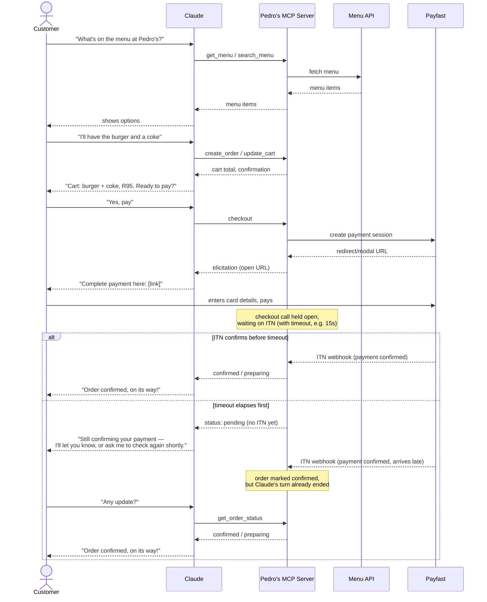

# Pedro's Claude Ordering Tool — Architecture Document

**Status:** Research/feasibility phase. No code written yet. This document synthesizes sessions 001–002.

---

## 1. What this is

A way for a customer to order and pay for a meal from Pedro's through *any* Claude surface — claude.ai, Claude Desktop, Claude Code, mobile — using natural language.

Pedro's already has:
- A **menu API** (used by their existing mobile app)
- **Payfast** as their online payment acquirer (used by their existing mobile app)

The job is to expose these to Claude, not rebuild them.

## 2. Why a remote MCP server

The requirement is that ordering works from *any* Claude client. The mechanism Anthropic provides for that is a **Claude Connector**: a third party hosts their own remote MCP server, registers it as a connector, and Anthropic's cloud infrastructure connects out to it from every Claude surface. One server, every client, no per-surface app.

This satisfies "any Claude surface" without duplicating client-specific integration work four times over. A dedicated customer-facing chat widget isn't ruled out by this — it could later sit on top as one more client of the same MCP server, rather than being a separate integration.

## 3. High-level architecture

```
Claude (any surface)
      │  MCP (remote connector)
      ▼
Pedro's MCP Server  ──────►  Menu API (existing)
      │
      └──────►  Order backend  ──────►  Payfast (existing acquirer)
                                              │
                                    ITN webhook (payment confirmation)
```

Claude never touches a card number and never executes a real-world side effect itself. Anthropic's tool-use loop is strictly: Claude emits `tool_use` → the MCP server executes it → returns a `tool_result`. A "pay" tool only ever *triggers* a Payfast checkout session; Payfast (PCI DSS Level 1 compliant) handles the actual card data on both of its integration paths, so neither Claude nor Pedro's server ever touches raw card data.

## 4. User journey

A single order, start to finish, showing which tool each step maps to and where the customer leaves Claude to actually pay.



Three things worth noting about this journey:
- The only point the customer leaves the Claude conversation is the payment step itself (Option A redirect or Option B modal) — everything else, including confirmation, happens back in chat.
- There's no way for Pedro's server to push a message into a Claude conversation on its own — MCP has no server-initiated notification into a closed chat turn. So instead of the customer having to ask "did it go through?", the `checkout` call itself stays open server-side until ITN confirms (or a timeout passes), and Claude reports the *final* status as its very next message.
- **Timeout fallback:** if ITN hasn't landed by the time the held-open `checkout` call has to return, the server reports `pending` rather than blocking indefinitely, and Claude sets the expectation that confirmation is still in progress. The customer falls back to asking again (`get_order_status`), same as the original polling design — this path only triggers when ITN is unusually slow, not on every order.

## 5. MCP tools (proposed surface)

| Tool | Purpose |
|---|---|
| `get_menu` / `search_menu` | Read from Pedro's existing menu API |
| `create_order` / `update_cart` | Build up an order server-side, no payment involved |
| `checkout` | The *only* tool that talks to Payfast — creates a payment session |
| `get_order_status` | Polled after Payfast's ITN webhook confirms payment |

This mirrors the pattern found in both the Stripe MCP monetization reference and an open-source food-ordering agent (Temporal's "Tony's Pizza Palace"): cart-building is a local, non-payment tool; checkout is isolated to a single tool that is the sole bridge to the payment provider. Keeping `checkout` as the only Payfast-touching tool is a deliberate security boundary, not just a naming convenience.

## 6. Payment flow: Payfast integration options

Payfast offers two integration paths, both already used by Pedro's mobile app (to be confirmed which):

### Option A — Custom Integration (redirect)
Customer is redirected to a Payfast-hosted payment page, pays, gets redirected back. Simplest, fully offloads PCI scope.

### Option B — Onsite Payments (Beta)
In-page modal via Payfast JS SDK, backed by a `/onsite/process` UUID the merchant server generates. Feels native, still PCI-safe (iframe/modal holds the card fields, not the merchant page).

**Mapping onto MCP:** MCP has a mechanism called **elicitation** (URL mode) — the server can ask the client to open a URL to complete an out-of-band step. This maps directly onto either Payfast path: the `checkout` tool triggers elicitation, the customer completes payment in the redirect or modal, and the server picks up confirmation via ITN. This is the concrete mechanism for the payment step — it isn't a new pattern to invent.

### Payment confirmation — ITN webhook
Regardless of path, Payfast confirms payment via an **Instant Transaction Notification (ITN)** webhook, not via the redirect itself. The redirect/modal completing is not proof of payment — ITN is. Pedro's server must implement all four required verification checks on ITN receipt:
1. Signature validation
2. Source IP validation (must be from Payfast)
3. Amount match against the original order
4. Live server validation callback to Payfast

`get_order_status` is the tool Claude polls after triggering checkout, backed by whatever state ITN has last written.

### Recurring billing / saved cards
Payfast supports **Tokenization** for repeat charges without re-entering card details. Whether this is used depends on the guest-vs-logged-in decision (open question, below).

## 7. Identity: why OAuth matters here

Without OAuth on the Connector, **Claude passes zero user identity to Pedro's MCP server** — no user ID, no session token, nothing. Every order would be structurally anonymous from the server's point of view: it has no way to know two calls came from the same customer, let alone attach a saved card or order history to a person.

MCP Connector OAuth (OAuth 2.1, mandatory PKCE) is the only mechanism that changes this. Full flow, for reference:

```
Tool call without token
   │
   ▼
401 + WWW-Authenticate header
   │
   ▼
Client fetches Protected Resource Metadata
   │
   ▼
Authorization server discovery
   │
   ▼
Client registration (Client ID Metadata Documents, Dynamic Client
Registration, or pre-registered credentials)
   │
   ▼
Redirect to authorization server → user consents
   │
   ▼
Token exchange (PKCE-verified)
   │
   ▼
Bearer token attached to every subsequent tool call
```

Notes:
- Callback URLs differ per Claude surface (claude.ai vs. Desktop vs. Code) — the authorization server needs to allow all of them.
- Anthropic stores/refreshes the token on its side (encrypted); disconnecting the connector in Claude does **not** revoke the token at the identity provider — that has to be handled separately if it matters.
- **Whether this is needed at all is a Pedro's product decision, not a technical one** — it hinges entirely on the guest-vs-saved-card question below.

## 8. Hosting

No hosting platform has been committed to. **Cloudflare Workers** (`McpAgent` — a Durable-Object-backed stateful MCP server — plus `workers-oauth-provider`) was researched as one concrete, well-documented path, explicitly *because it's tooling already familiar in this workspace*, not because anything is known about Pedro's actual infrastructure. This was flagged mid-research as a bias to correct for, not a recommendation.

**Nothing here should be treated as decided until Pedro's infrastructure is actually known.**

## 9. Open questions (blocking, Pedro's-side)

These aren't answerable by further external research — they're facts and decisions that live with Pedro's:

1. **Does the existing mobile app backend already implement Payfast Custom or Onsite integration?** If yes, the MCP server likely wraps existing payment plumbing rather than building new. This is the single highest-leverage question — it could eliminate most of the payment-integration work.
2. **Guest checkout vs. logged-in customers with saved cards (Tokenization)?** This decides whether Connector OAuth and an account system are needed at all, or whether every order can be a simple redirect-and-forget.
3. **What infrastructure does Pedro's actually run?** Needed before committing to Cloudflare Workers or any other hosting platform.
4. **What timeout should the held-open `checkout` call use before falling back to "still confirming"?** (See §4, user journey.) Depends on Payfast's typical ITN latency in practice — worth checking against Pedro's existing app's observed confirmation times rather than guessing a number.

## 10. Next steps

- [ ] Ask Pedro's the open questions above
- [ ] Based on answers, lock in: hosting platform, OAuth yes/no, Payfast integration path (Custom vs. Onsite), checkout timeout value
- [ ] Scaffold the MCP server with the four tools: `get_menu`, `create_order`/`update_cart`, `checkout`, `get_order_status`

## 11. Demo plan (sandbox Payfast + Cloudflare Workers)

Everything above is the real-Pedro's architecture, still blocked on the open questions in §9. Separately, all the pieces needed to build a **working, deployed, non-production demo** are now confirmed:

- **Payfast Sandbox** is a self-serve, instant, no-KYC test environment (separate merchant ID/key from any live account), with a shared public test merchant (ID `10000100`, key `46f0cd694581a`, passphrase `jt7NOE43FZPn`) and test buyer login (`sbtu01@payfast.io` / `clientpass`) that pays from a dummy wallet. Full ITN round-trip works identically to production, including signature validation and the same four-host IP allowlist (`sandbox.payfast.co.za` is one of the four valid hosts) — so the ITN handler needs no sandbox/live branching. One quirk to design around: **sandbox sends each ITN only once**, no retry, so the held-open `checkout`/timeout logic (§4) needs to tolerate a missed notification more carefully than production might.
- **Cloudflare Workers + `McpAgent`**, no OAuth — the demo skips §7 entirely (no Connector auth, no `props`, no per-user identity) since it's a single guest flow, not a real customer base. This removes the KV namespace / OAuth provider setup and leaves a much smaller wrangler config: just a `durable_objects` binding + `new_sqlite_classes` migration for the `McpAgent`'s Durable Object (per `research/getting-started-cloudflare-durable-objects-docs.md` and `research/add-to-existing-project-cloudflare-agents-docs.md`).
- **One Worker, two routes**: `routeAgentRequest(request, env)` handles `/mcp` (the MCP endpoint Claude talks to); if it returns null, fall through to a plain `fetch` handler for `POST /webhooks/payfast-itn` (Payfast's ITN callback). Confirmed pattern in `research/add-to-existing-project-cloudflare-agents-docs.md` — no separate Worker or router library needed.
- **Local dev secrets**: Payfast sandbox merchant ID/key/passphrase go in a local `.dev.vars` file (dotenv format, gitignored) for `wrangler dev`, promoted to real `wrangler secret put` values only at deploy time. Per `research/secrets-cloudflare-workers-docs.md`.
- **Testing during development**: MCP Inspector or Cloudflare's AI Playground against the deployed `/mcp` URL first (per `research/test-a-remote-mcp-server-cloudflare-agents-docs.md`), then adding the deployed Worker URL as a **custom connector** in Claude (Settings > Connectors > Add custom connector — no OAuth fields needed since there's no auth) for the real end-to-end test inside an actual Claude conversation. Per `research/third-party-connectors-with-remote-mcp-claudeai-documentation.md`.
- **Menu data**: the demo does not touch Pedro's real menu API (no access, and not needed to prove the architecture) — `get_menu` returns a small hardcoded/mocked menu instead. Everything downstream (cart, checkout, ITN, status) is real.

### Demo build steps

1. `npm create cloudflare@latest -- pedros-mcp-demo --template=cloudflare/ai/demos/remote-mcp-authless` — scaffolds the no-auth `McpAgent` starter directly (confirmed template path in `research/build-a-remote-mcp-server-cloudflare-agents-docs.md`).
2. Define the four tools on the `McpAgent` subclass: `get_menu` (hardcoded data), `create_order`/`update_cart` (writes to `this.state`, per-session cart), `checkout` (builds the signed Payfast Sandbox payment request, returns an elicitation URL, holds the call open pending ITN or timeout), `get_order_status` (reads last-known status from state).
3. Add the `/webhooks/payfast-itn` route alongside `routeAgentRequest()` in the Worker's `fetch` handler; implement the four ITN checks from §6 against the sandbox host list.
4. `.dev.vars` with sandbox merchant ID/key/passphrase; `wrangler dev` to iterate locally (ITN needs a public URL to reach the Worker even in dev — reuse the ngrok setup already configured on this machine, or just iterate against the deployed dev Worker directly since Cloudflare deploys are fast).
5. `wrangler deploy`; verify with MCP Inspector against the live `/mcp` URL.
6. Add the deployed URL as a custom connector in Claude; run one real order end-to-end (browse mocked menu → cart → checkout → pay via sandbox test wallet → ITN confirms → Claude reports confirmation).

### What the demo deliberately does not prove

- Real menu data, real infrastructure integration, OAuth/identity, or Payfast's real card/EFT UI (sandbox only exercises the dummy wallet — see §"known limitations" in `research/sandbox-payfast.md` and `research/payfast-dev-docs-homepage-rendered.md`). It proves the *shape* of the architecture — MCP tool surface, held-open checkout, ITN confirmation loop — not the production integration itself.

## 12. Research index

All source material this document is drawn from lives in `research/`:

- `payfast-developer-docs.md`, `payfast-onsite-itn-details.md` — Payfast integration paths, ITN verification, tokenization
- `payfast-dev-docs-homepage-rendered.md`, `payfast-dev-docs-api-rendered.md`, `sandbox-payfast.md`, `payfast-developer-documentation.md`, `testing-guide-dj-payfast-0111-documentation.md` — Payfast Sandbox: test credentials, ITN-in-sandbox behavior, signup process, limitations
- `claude-tool-use-and-agentic-commerce.md` — how Claude tool use works, industry agentic-commerce context
- `claude-connectors-mcp.md`, `mcp-connector-claude-platform-docs.md` — Claude Connectors / remote MCP mechanics
- `mcp-oauth-mechanics.md`, `authorization-model-context-protocol.md`, `claude-connector-authentication-how-oauth-works-and-when-you-need.md` — OAuth flow detail (real architecture only — demo skips this)
- `mcp-commerce-reference-implementations.md`, `model-context-protocol-mcp-stripe-documentation.md`, `monetize-your-model-context-protocol-mcp-app-stripe-documentation.md`, `mcp-tools-food-ordering-temporal-communitytemporal-ai-agent-deepwiki.md` — reference implementations (Stripe MCP apps, Temporal food-ordering agent)
- `mcp-hosting-infra.md`, `build-a-remote-mcp-server-cloudflare-agents-docs.md`, `mcpagent-cloudflare-agents-docs.md`, `build-on-cloudflare-workers-mcp-manager.md` — Cloudflare Workers hosting option (evaluated, not committed to for the real architecture; used directly for the demo)
- `add-to-existing-project-cloudflare-agents-docs.md`, `getting-started-cloudflare-durable-objects-docs.md`, `secrets-cloudflare-workers-docs.md`, `test-a-remote-mcp-server-cloudflare-agents-docs.md`, `third-party-connectors-with-remote-mcp-claudeai-documentation.md` — demo-build specifics: no-auth wrangler config, Durable Object bindings, multi-route Worker (MCP + ITN webhook), local dev secrets, testing, adding a custom Claude connector
